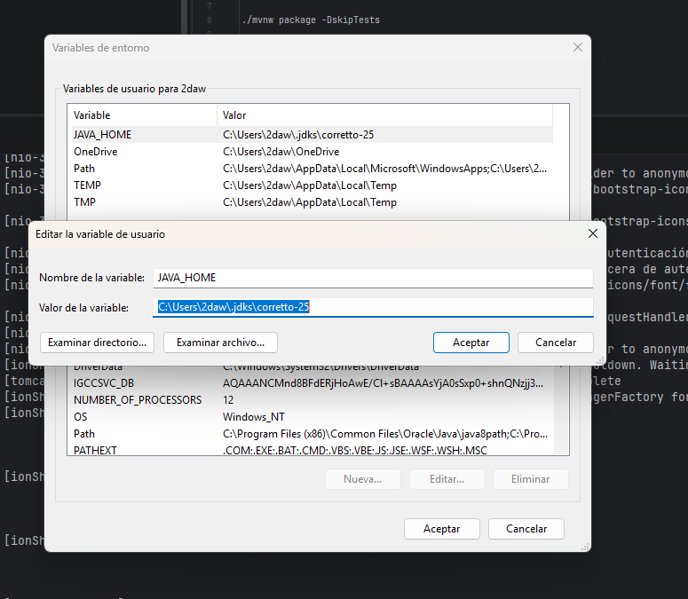

# Primero


# En el terminal
```
$env:Path = "$env:JAVA_HOME/bin;" + $env:Path
``` 
# Arrancamos eñ maven con esto 
```
./mvnw package
```

# Si queremos saltarnos los tests, usamos este comando
```
./mvnw package -DskipTests
```
# Una vez compilado, nos vamos a la carpeta target y ejecutamos el jar
```
cd target
```


# Ejecutamos el jar con este comando
```
java -jar .\AplicacionVideoJuegos.jar
```

# Para arrancar el docker
```
docker compose up
```

# Para el cocker de produccion
```
docker compose -f docker-compose-prod.yml up db 
```
# Para arrancar el docker de produccion en modo detached ```
```
docker compose -f docker-compose-prod.yml up -d db
```
# Para parar el docker y borrar el contenedor de la base de datos
```
docker compose -f docker-compose-prod.yml down -v  
```


# Primero


# En el terminal

```
$env:Path = "$env:JAVA_HOME/bin;" + $env:Path
```

---

# 🔧 ARRANCAR EN MODO **DEV**

## Compilar con Maven (perfil dev por defecto)

```
.\mvnw package
```

## Si queremos saltarnos los tests

```
.\mvnw package -DskipTests
```

## Ejecutar la aplicación en local (sin Docker)

```
cd target
java -jar .\AplicacionVideoJuegos.jar
```

👉 Usa:

* Base de datos **H2 en memoria**
* Configuración **dev**
* Datos de prueba

## Arrancar con Docker en DEV

```
docker compose -f docker-compose-dev.yml up --build
```

---

# 🏭 ARRANCAR EN MODO **PROD**

## Compilar con perfil producción

```
.\mvnw package -Pprod -DskipTests
```

## Arrancar aplicación + PostgreSQL en Docker

```
docker compose -f docker-compose-prod.yml up --build
```

## Arrancar solo la base de datos

```
docker compose -f docker-compose-prod.yml up db
```

### En segundo plano (detached)

```
docker compose -f docker-compose-prod.yml up -d db
```

## Parar contenedores y borrar volumen de la base de datos

```
docker compose -f docker-compose-prod.yml down -v
```

---

# ⭐ Resumen rápido

## ▶️ DEV

```
.\mvnw package
docker compose -f docker-compose-dev.yml up --build
```

## ▶️ PROD

```
.\mvnw package -Pprod -DskipTests
docker compose -f docker-compose-prod.yml up --build
```
